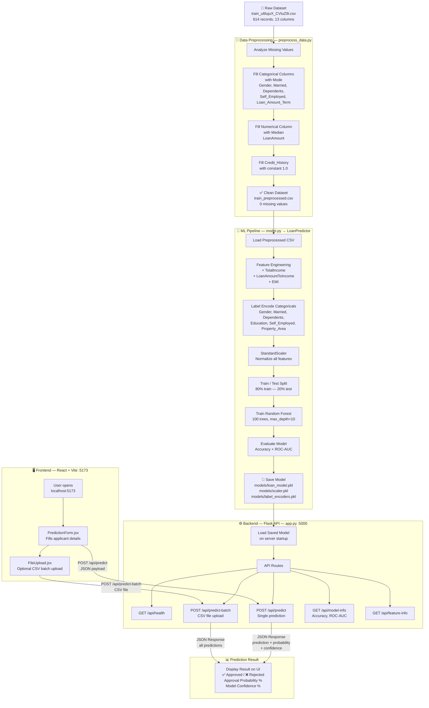
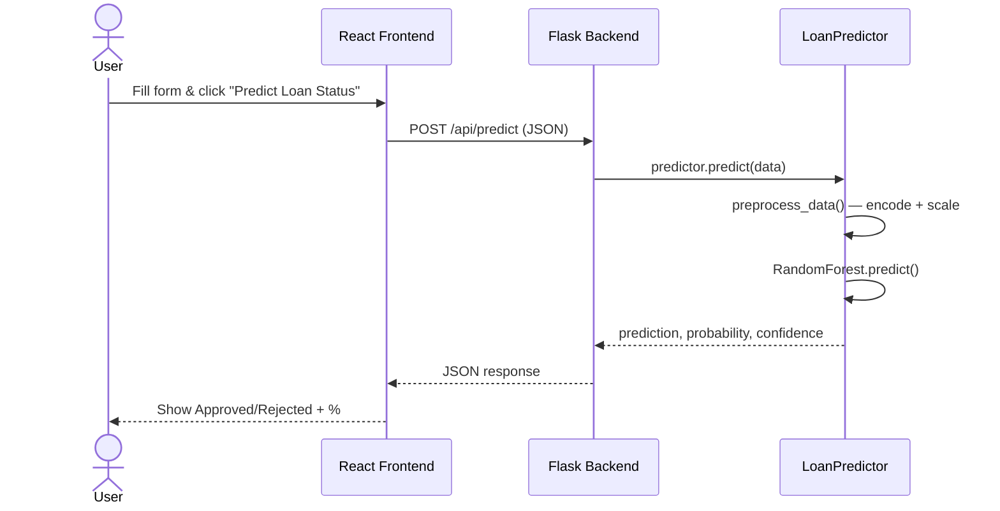

# Loan Prediction AI — Project Flow Diagram

## 🗂️ Full System Architecture



---

## 🔄 Single Prediction Flow



---

## 📦 Project File Structure

```
python_project/
├── 📄 train_u6lujuX_CVtuZ9i.csv       ← Raw training dataset
├── 📄 train_preprocessed.csv           ← Clean dataset (0 missing values)
│
├── backend/
│   ├── app.py                          ← Flask API server (port 5000)
│   ├── model.py                        ← LoanPredictor class (RF model)
│   ├── preprocess_data.py              ← Standalone cleaning script
│   ├── requirements.txt
│   └── models/
│       ├── loan_model.pkl              ← Trained Random Forest
│       ├── scaler.pkl                  ← StandardScaler
│       ├── label_encoders.pkl          ← LabelEncoders
│       └── feature_columns.pkl
│
└── frontend/
    └── src/
        └── components/
            ├── PredictionForm.jsx      ← Single prediction form
            ├── FileUpload.jsx          ← Batch CSV prediction
            ├── Navbar.jsx
            └── Footer.jsx
```

---

## 🧠 ML Model Summary

| Property | Value |
|---|---|
| **Algorithm** | Random Forest Classifier |
| **Trees** | 100 estimators |
| **Max Depth** | 10 |
| **Train/Test Split** | 80% / 20% |
| **Features Used** | 14 (11 original + 3 engineered) |
| **Engineered Features** | TotalIncome, LoanAmountToIncome, EMI |
| **Output** | Approved / Rejected + Probability % |
